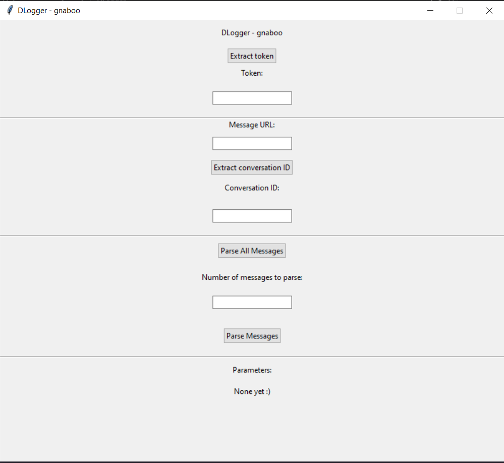
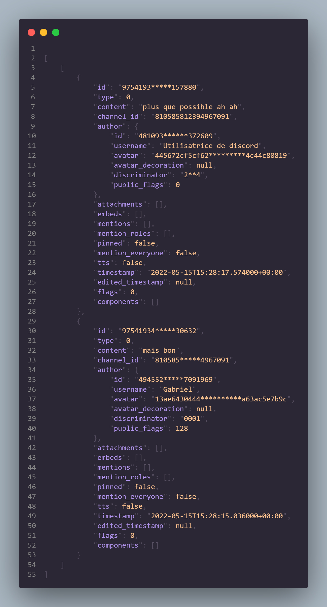
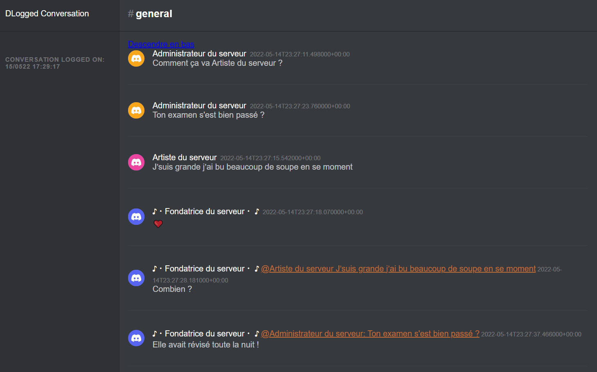

  

  <h3 align="center">DLogger</h3>

  

A simple discord logging tool  

## Quelques explications

Ce project a été conçu en 2022, alors que j'étais en classe de 2nd.

Au moment où je rédige ce document, nous sommes en mai 2026, et en raison de changements dans l'API de Discord, ce projet ne fonctionne plus.

Pourtant, je trouve dommage d'oublier ce project, auquel j'ai consacré beaucoup de temps et dont je reste fier. 

Pour ces raisons, et à l'aide de tests que j'avais effectué sur mon ordinateur à l'époque, je vous propose d'explorer ensemble comment fonctionnait ce projet à l'époque.

J'ai décidé de laisser le code intact afin de vous le présenter. Vous aurez donc un aperçu de ma manière de coder en 2022, à mes 15 ans.

**Notons que toutes les données ont étés anonymisés, et que les conversations ont été réécrites pour des raisons de confidentialité.**

## Comment tout cela fonctionne

Tout commence avec le script ``interface.py``, qui déclenche une interface tkinter (toujours fonctionnelle), nous permettant d'intéragir avec discord.

Fonctionnement des différents boutons

- Le bouton ``Extract token`` appel la fonction, ``gettoken`` présente dans _token.py, et extrait le token Discord stocké par l'application Discord.

- La manière dont Discord présente les messages et les enregistre en interne est très différente. Il était donc nécessaire, afin de pouvoir communiquer avec son API, d'obtenir l'ID de conversation à partir de l'URL d'un des message (beaucoup plus simple à obtenir pour un utilisateur), d'où l'utilité du bouton ``Extract conversation ID``

- Le bouton ``Parse All Messages`` déclenchait alors la fonction ``parseallmessages`` dans _parser_.py. Cette fonction envoyait, avec des délais aléatoires ajoutés pour éviter d'être bloqués par discord, des requêtes à Discord, jusqu'à avoir obtenu l'entièreté de la conversation. Les messages étaient ensuite enregistrés sur l'ordinateur

- Les formats d'enregistrements par défaut sont JSON (qui sont le format des réponses de Discord). Nous transformons ensuite ces données pour obtenir une page HTML, imitant le style de Discord, afin de faciliter la lecture des données.

## Formattage des données

Voici les données JSON du fichier `\output\exemple.json`

Voici une visualisation du fichier `\output\exemple.html`

## En pratique

En pratique, le projet fonctionnait particulièrement bien. Il avait en particulier réussit à enregistrer plusieurs mégaoctets de conversations sur un serveur (dont j'avais l'autorisation d'enregistrer les données) en quelques minutes.